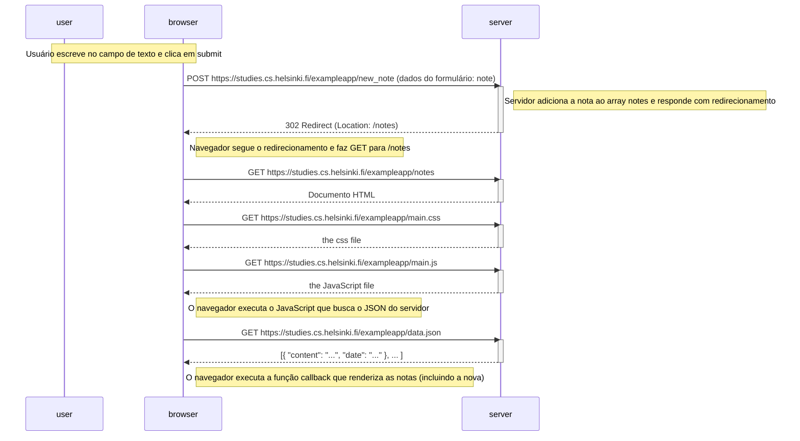

```mermaid
sequenceDiagram
    participant user
    participant browser
    participant server

    Note over user,browser: Usuário escreve no campo de texto e clica em submit

    browser->>server: POST https://studies.cs.helsinki.fi/exampleapp/new_note (dados do formulário: note)
    activate server
    Note right of server: Servidor adiciona a nota ao array notes e responde com redirecionamento
    server-->>browser: 302 Redirect (Location: /notes)
    deactivate server

    Note right of browser: Navegador segue o redirecionamento e faz GET para /notes

    browser->>server: GET https://studies.cs.helsinki.fi/exampleapp/notes
    activate server
    server-->>browser: Documento HTML
    deactivate server

    browser->>server: GET https://studies.cs.helsinki.fi/exampleapp/main.css
    activate server
    server-->>browser: the css file
    deactivate server

    browser->>server: GET https://studies.cs.helsinki.fi/exampleapp/main.js
    activate server
    server-->>browser: the JavaScript file
    deactivate server

    Note right of browser: O navegador executa o JavaScript que busca o JSON do servidor

    browser->>server: GET https://studies.cs.helsinki.fi/exampleapp/data.json
    activate server
    server-->>browser: [{ "content": "...", "date": "..." }, ... ]
    deactivate server

    Note right of browser: O navegador executa a função callback que renderiza as notas (incluindo a nova)
```
