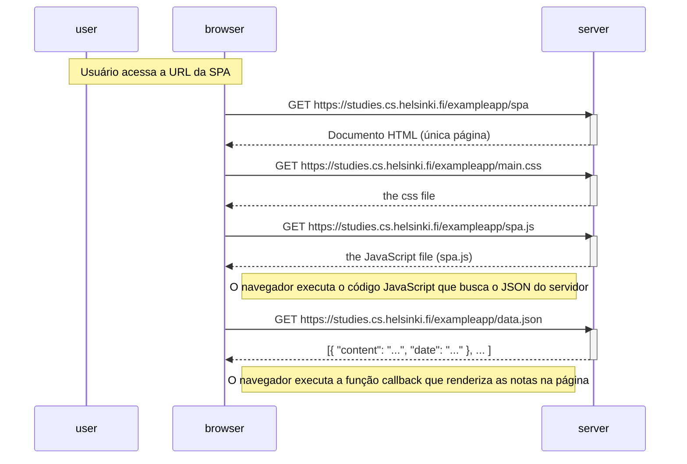

# Diagrama: uso da aplicação de página única (SPA)

Diagrama que retrata o contexto em que o usuário utiliza a versão SPA das notas em <https://studies.cs.helsinki.fi/exampleapp/spa> (carregamento inicial da página).



---

## Quando o usuário adiciona uma nova nota na SPA

```mermaid
sequenceDiagram
    participant user
    participant browser
    participant server

    Note over user,browser: Usuário escreve no campo de texto e clica em submit

    Note right of browser: JavaScript: preventDefault() evita o envio tradicional do formulário

    Note right of browser: JavaScript: cria o objeto nota, adiciona à lista local e redesenha as notas na página (redrawNotes)

    browser->>server: POST https://studies.cs.helsinki.fi/exampleapp/new_note_spa (Content-Type: application/json)
    activate server
    Note right of server: Servidor adiciona a nota ao array notes
    server-->>browser: 201 Created (sem redirecionamento)
    deactivate server

    Note right of browser: Página permanece a mesma; não há novo GET de HTML, CSS, JS ou data.json
```
