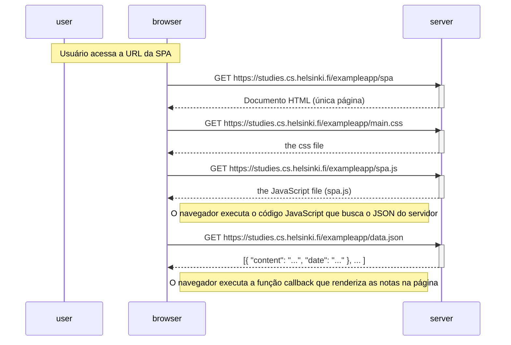

# Diagrama: uso da aplicação de página única (SPA)

Diagrama que retrata o contexto em que o usuário utiliza a versão SPA das notas em <https://studies.cs.helsinki.fi/exampleapp/spa> (carregamento inicial da página).

